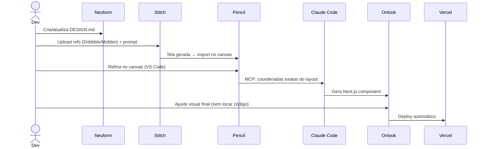
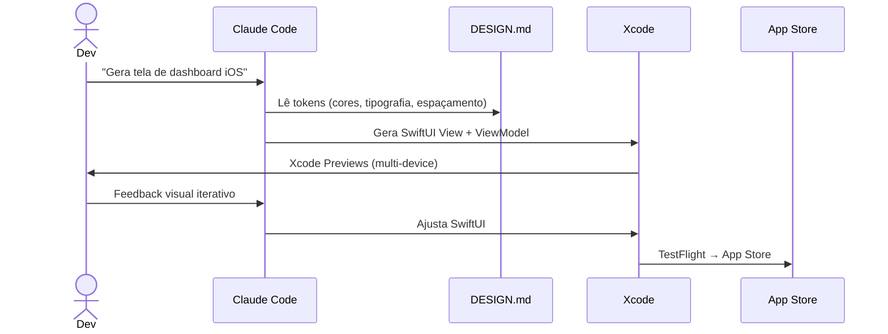
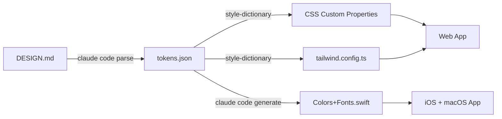

# Sistema de Prototipagem e Codificação Frontend — Khard AI

**Data:** 2026-04-30  
**Produto-alvo:** App de mentoria agêntica para candidatos à residência médica  
**Plataformas:** Web (PWA) · iOS (SwiftUI) · macOS (SwiftUI Multiplatform)  
**Status:** Design aprovado, aguardando implementação

---

## 1. Visão Geral

O sistema é a **fusão operacional de 4 ferramentas** — Neuform, Google Stitch, Onlook e Pencil — com Claude Code como orquestrador central via MCP. O objetivo é criar um pipeline prompt-to-production que entregue simultaneamente para Web, iOS e macOS a partir de uma única fonte de verdade visual.

### Princípio Central

> *"Design e código são a mesma coisa. O DESIGN.md é o protocolo que os mantém sincronizados."*

---

## 2. As 4 Ferramentas e seus Papéis

### 2.1 Neuform (neuform.ai)
**Papel:** Criação e manutenção do DESIGN.md · Exploração de direção visual

- **Input:** Prompt em linguagem natural
- **Output:** HTML/CSS + DESIGN.md + Figma handoff
- **Uso no sistema:** Geração do DESIGN.md do produto (identidade, tokens, regras de componentes). 593 templates remixáveis como ponto de partida. 63 prompt skills para técnicas específicas (gradientes, animações, grids).
- **Plano:** Pro ($25/mês) para uso comercial e gerações privadas

### 2.2 Google Stitch (stitch.withgoogle.com)
**Papel:** Image→UI · Voice canvas · Exploração com Gemini

- **Input:** Screenshot de referência + DESIGN.md + prompt
- **Output:** HTML/TailwindCSS · Figma export
- **Uso no sistema:** Screenshots dos Dribbble/Mobbin curados (ja salvos em `design-inspiration/`) são usados como referência visual para o Stitch gerar telas equivalentes com o design language do produto.
- **Modelo:** Gemini 2.5 Flash (350 gen/mês) · Gemini 2.5 Pro (50 gen/mês)
- **Status:** Gratuito (Google Labs Beta)
- **Stitch 2.0 features:** canvas infinito, voice canvas, MCP server para IDEs, DESIGN.md nativo

### 2.3 Onlook (onlook.com)
**Papel:** Edição visual direta no Next.js sem handoff

- **Input:** Projeto Next.js + TailwindCSS rodando
- **Output:** Mudanças escritas de volta no código via AST parse
- **Uso no sistema:** Refinamento visual da versão web. Designer seleciona elementos na tela, ajusta visualmente, código é atualizado automaticamente. Sem loop design→dev.
- **Arquitetura técnica:** Web container (CodeSandbox SDK) + iFrame + instrumentação build-time + sourcemaps DOM→arquivo:linha + write-back via AST
- **Constraint:** Suporta apenas Next.js + TailwindCSS (sem SwiftUI)
- **Plano:** Self-hosted gratuito (Apache 2.0, 25.7k stars no GitHub)

### 2.4 Pencil (pencil.dev)
**Papel:** Canvas de design dentro do IDE · MCP bidirecional com Claude Code

- **Input:** Canvas vetorial infinito (.pen files) + prompts Claude
- **Output:** React/Tailwind components (TypeScript) · HTML/CSS
- **Uso no sistema:** Design acontece dentro do VS Code/Cursor. Pencil atua como servidor MCP — Claude Code lê coordenadas exatas e escreve de volta no canvas. .pen files versionados no Git junto ao código.
- **Diferencial técnico:** coordenadas vetoriais exatas via MCP (não image-to-code). Precisão pixel-perfect no output.
- **Plano:** Gratuito. Custo de AI = conta Claude API existente.
- **Backed by:** Y Combinator

---

## 3. Claude Code como Orquestrador MCP

Claude Code não é apenas uma ferramenta auxiliar — é o **hub central** do sistema via MCP:

```
Claude Code
  ├── MCP → Pencil (bidirecional: read canvas + write back)
  ├── MCP → Stitch (read designs)
  ├── Browser Harness → Neuform (navegação e extração)
  └── Xcode → SwiftUI generation (via CLI/shell)
```

**O que Claude Code faz no pipeline:**
1. Lê o DESIGN.md do Neuform e extrai tokens estruturados
2. Lê o canvas do Pencil via MCP, obtém coordenadas exatas
3. Gera componentes React/Tailwind para web
4. Converte o mesmo layout para SwiftUI com tokens do DESIGN.md
5. Adapta o SwiftUI para macOS (sidebar, toolbar, split view)
6. Mantém sincronização entre as 3 versões

---

## 4. Arquitetura — Diagrama Mermaid

```mermaid
graph TD
    DM[DESIGN.md · Neuform]
    DM --> ST[Stitch · Image→UI · Gemini]
    DM --> PE[Pencil · Canvas no IDE]
    DM --> CC[Claude Code · MCP Hub]

    ST --> PE
    PE -->|MCP bidirecional| CC

    CC --> WEB[Web · Next.js · Onlook]
    CC --> IOS[iOS · SwiftUI · Xcode]
    CC --> MAC[macOS · SwiftUI Multiplatform]

    WEB --> V[Vercel · PWA instalável]
    IOS --> AS[App Store]
    MAC --> MAS[Mac App Store]

    style DM fill:#312e81,stroke:#6366f1
    style CC fill:#3b0764,stroke:#7c3aed
    style WEB fill:#1e3a8a,stroke:#3b82f6
    style IOS fill:#4c1d95,stroke:#8b5cf6
    style MAC fill:#064e3b,stroke:#10b981
```



---

## 5. Fluxo de Trabalho por Plataforma

### 5.1 Web (Next.js + PWA)



**Stack:** Next.js 15 · TailwindCSS v4 · TypeScript · Shadcn/UI · Vercel

### 5.2 iOS (SwiftUI)



**Stack:** SwiftUI · Swift 6 · Xcode 16 · Swift Concurrency · Lottie

### 5.3 macOS (SwiftUI Multiplatform)

O macOS usa 90% do mesmo código Swift do iOS com adaptações via `#if os(macOS)`:

| Componente iOS | Equivalente macOS |
|---------------|-------------------|
| TabView bottom | Sidebar NavigationSplitView |
| NavigationStack push | NavigationSplitView detail |
| Sheet | Window/Panel |
| Haptics | Não disponível |
| Widget small | Menu Bar extra |

**Estratégia:** SwiftUI multiplatform target no mesmo Xcode project. Mac Catalyst como fallback para MVP.

---

## 6. DESIGN.md do Produto

O DESIGN.md é o arquivo que alimenta todos os geradores. Para o app de residência:

```markdown
# DESIGN.md — Khard Residência App

## Identidade
Produto: App de mentoria agêntica para candidatos à residência médica
Tom: Profissional, confiável, motivador — sem ser clínico ou frio
Nível: Estudante universitário de medicina, 25-32 anos

## Paleta
--primary: #1A3A5C (Navy médico)
--accent: #00C896 (Verde conquista)
--surface: #F8F9FA (Leitura longa)
--dark-surface: #111827 (Dark mode)
--text-primary: #0F172A
--text-secondary: #64748B

## Tipografia
Font: SF Pro Display (iOS/macOS) / Inter (web)
Scale: 12 · 14 · 16 · 18 · 24 · 32 · 48
Line-height: 1.5 (corpo) · 1.2 (títulos)

## Componentes-chave
- ProgressRing: circular, animado, verde quando acima de 80%
- StreakCounter: fire emoji + número, reset visual quando quebra
- DisciplineCard: icon + nome + % + mini chart
- MentorMessage: avatar agente + texto + timestamp
- CelebrationBurst: partícula ao completar meta

## Regras
- Sem gradientes em botões primários (flat design)
- Sempre dark mode disponível
- Minimum touch target: 44x44pt
- Sem modais de bloqueio sem escape claro
```

---

## 7. Referências Visuais Já Coletadas

Pasta: `staff.khard.ai/design-inspiration/`

| Categoria | Quantidade | Mais relevante |
|-----------|-----------|----------------|
| Mentoring App | 12 screenshots | Mentees, Pelonous, Ohspace |
| AI Coaching | 8 screenshots | Ruslan Kosinov "AI-Enabled Platform" |
| Progress Tracking | 10 screenshots | Artspire, Deleau UX |
| Medical Study | 9 screenshots | Phenomenon Studio (130k views) |
| Streak/Gamificação | 9 screenshots | Muzemind, LAIN |

Vídeos SwiftUI: `staff.khard.ai/videos/swiftui-animations/` (9 MP4, ~250MB)

---

## 8. Infraestrutura do Sistema

### 8.1 Repositórios

```
khard-residencia/
├── apps/
│   ├── web/          # Next.js 15 (Onlook + Pencil target)
│   ├── ios/          # SwiftUI iOS
│   └── macos/        # SwiftUI macOS (shared com iOS)
├── packages/
│   ├── design-tokens/  # DESIGN.md → tokens JS + Swift gerados
│   └── shared-types/   # TypeScript shared types
├── design/
│   └── *.pen           # Pencil canvas files (versionados)
└── DESIGN.md           # Fonte de verdade
```

### 8.2 Design Token Pipeline



### 8.3 MCP Servers Necessários

| Server | Propósito | Instalação |
|--------|-----------|------------|
| Pencil MCP | Canvas bidirecional no IDE | Extensão VS Code |
| Stitch MCP | Consumir designs do Stitch | Configurar em settings.json |
| Browser Harness | Neuform + sites de referência | Já instalado (`~/.local/bin/browser-harness`) |

---

## 9. Constraints e Decisões de Design

| Constraint | Decisão |
|------------|---------|
| Onlook não suporta SwiftUI | Xcode Previews como substituto. Mesma filosofia de "ver antes de commitar". |
| Stitch só exporta HTML (não React/SwiftUI) | Usar como referência visual, não como código final. |
| Pencil .pen files são JSON — sem SwiftUI | Pencil gera protótipo web; Claude traduz para SwiftUI. |
| Neuform cobra por prompt | Usar para criar DESIGN.md uma vez + remix de direção; não para cada tela. |
| macOS pode usar Catalyst | MVP via Catalyst. SwiftUI nativo para v2. |

---

## 10. Critérios de Sucesso

- [ ] DESIGN.md criado com identidade completa do produto
- [ ] Tokens gerados automaticamente para web (CSS/Tailwind) e SwiftUI (Swift extension)
- [ ] Pipeline Pencil → Claude Code → Next.js funcionando (canvas → componente)
- [ ] Pipeline Stitch → referência → Claude Code → SwiftUI funcionando
- [ ] Onlook self-hosted rodando com o projeto Next.js
- [ ] Xcode Preview multi-device configurado como feedback loop iOS/macOS
- [ ] 3 telas completas entregues em todas as plataformas (Dashboard, Sessão de Estudo, Perfil)
- [ ] Design system consistente entre web e nativo (mesmos tokens)

---

## 11. Próximos Passos (Ordem)

1. **Criar DESIGN.md completo** via Neuform (já temos referências visuais coletadas)
2. **Configurar Pencil** no VS Code com MCP para Claude Code
3. **Configurar Stitch MCP** no settings.json do Claude Code
4. **Montar monorepo** `khard-residencia/` com estrutura definida no item 8
5. **Gerar design tokens** a partir do DESIGN.md (CSS + Swift)
6. **Prototipar Dashboard web** (Pencil canvas → Claude → Next.js)
7. **Traduzir para SwiftUI** (web aprovado → Claude → SwiftUI iOS)
8. **Adaptar para macOS** (iOS → macOS target no Xcode)
9. **Self-host Onlook** para polish visual da versão web
10. **Deploy web** (Vercel) · **TestFlight** iOS · **Distribuição** macOS

---

*Spec gerado em sessão de brainstorming com subagentes de pesquisa. Informações dos subagentes confirmadas por navegação real nas ferramentas.*
